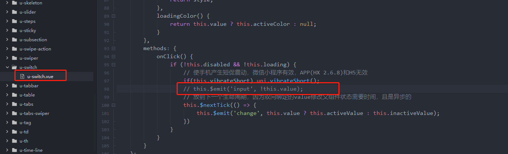
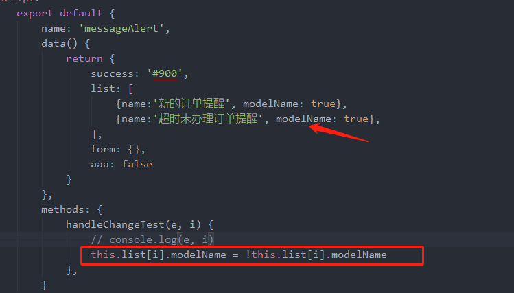

# uniapp

> uni-app 是一个使用 Vue.js 开发所有前端应用的框架，开发者编写一套代码，可发布到 iOS、Android、Web（响应式）、以及各种小程序（微信/支付宝/百度/头条/QQ/钉钉/淘宝）、快应用等多个平台。

## 传送门

[uniapp](https://uniapp.dcloud.io/)

## 问题整理

### 项目常见问题

1. uniapp 小程序 vendor 打包优化

-   分包优化 [传送门](https://uniapp.dcloud.io/collocation/manifest?id=%e5%85%b3%e4%ba%8e%e5%88%86%e5%8c%85%e4%bc%98%e5%8c%96%e7%9a%84%e8%af%b4%e6%98%8e)（最优解决：合理分包，理性开发）
-   减少主入口文件 main.js 的全局引用（有效：分散 vendor 资源）
-   开启 gzip [传送门](https://blog.csdn.net/qq_38998250/article/details/107684017) (作用不大：未测试微信服务渲染是否开启 gzip 解压)

2. 数据渲染

    ```js
    // demo
    var testArray = [{ key: 1 }, { key: 2 }];
    this.testArray[0].flag = true; // [ {key: 1, flag: true}, {key: 2} ]; 数据变更，页面未渲染

    // 解决方案：
    this.$set(testArray, 0, { ...testArray[0], flag: true });
    ```

3. 循环对象传参

    ```js
    // demo
    <view v-for='item of demoList' :key='item.id' @click='handleClickDemoList(item)'>{{item}}</view> // 获取不到item对象

    // 解决方案：
    <view v-for='item of demoList' :key='item.id' data-item='itme' @click='handleClickDemoList($event)'>{{item}}</view>

    ```

### uView 插件问题整理

1. switch-error(Version 1.6.5)

    原因：官方封装存在问题

    - 解决方案：注释掉组件源码中的代码、组件调用时，在 change 事件中增加取反




<style scoped>
img{width: 100%}
</style>
