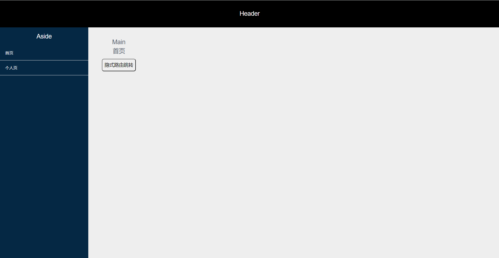

# requireJS

> RequireJS 是一个 JavaScript 文件和模块加载器，是 AMD 规范最好的实现者之一，最新版本的 RequireJS 压缩后只有 14K。但它也可以用在其他脚本环境, 就像 Rhino 和 Node. 使用 RequireJS 加载模块化脚本将提高代码的加载速度和质量

## requireJS 的利与弊

-   缺点：[传送门](https://blog.csdn.net/uikoo9/article/details/41556599)

1. 插件支持性：部分插件在 rq 内是无法正常调用的，这对应需大量第三方项目是极其不友好的

2. 原生 JS 开发事件编写：rq 使用后 js 为后加载，故找不到事件方法(如 οnclick='clickDemo'需变更\$(document).on())，需卸载 rq 内

-   优点：

1. 模块化管理：集成主入口文件调用

2. 异步加载：防止 js 加载阻塞页面渲染

3. 降低调用成本：主入口声明别名，define 直接调用

4. 插件市场丰富：存在较为丰富的 require 插件

看看大神怎么说 [传送门](https://www.ruanyifeng.com/blog/2012/11/require_js.html)

## 源码开放

### Git 地址

[传送门](https://github.com/kora-KR/Require-Vue)

### 源码技术

    基于 requireJS 的 vue 基础项目包，内置如下功能：

    1. 路由嵌套、组件嵌套、隐式路由
    2. 敏捷开发 require 插件(css、less、js)
    3. VUE 全家桶(路由守卫、iviewUI、axios、vuex)

### 源码解析

### 资源说明

1.  requireJS

    [传送门](https://www.ruanyifeng.com/blog/2012/11/require_js.html)

2.  require 辅助插件

        text less lessc css normalize

```js
备注：
[传送门 1](https://github.com/pingsrl/requirejs-less)
[传送门 2](https://github.com/guybedford/require-less)

相关资源已放置 /libs/ 目录下
```

3.  vue 资源

```js
① vuex (/libs/vuex 资源，src/vuex 下声明)
② vueRouter
③ iview [传送门](https://www.iviewui.com/)
```

### 路由页面创建流程

    1. 资源放置路径：/src/pages/
    2. 资源配置模式：html + less + js（可参考/src/pages/home 文件夹）
    3. 路由配置：/src/routes.js 内添加相应配置

### 组件创建流程

    1. 资源放置路径：/src/components/
    2. 资源配置模式：html + less + js（可参考/src/components/page-header 文件夹）
    3. /src/app.js 文件内添加配置（位置搜索： `Kora - 自定义组件`）

### 源码演示截图


